# CandleStick pattern

## What is a candlestick?
A candlestick shows an asset’s price movement over a set amount of time. This can be anywhere from a minute to a day, depending on the price chart. They display four different price levels which an asset has reached in the specified time period: the lowest point in an asset’s price, the highest point, and the open and close prices.

A candlestick is a way of displaying information about an asset’s price movement. Candlestick charts are one of the most popular components of technical analysis, enabling traders to interpret price information quickly and from just a few price bars.

The candlestick has three basic features:

- **The body**, which represents the open-to-close range
- **The wick**, or shadow, that indicates the intra-day high and low
- **The colour**, which reveals the direction of market movement – a green (or white) body indicates a price increase, while a red (or black) body shows a price decrease
- 
Over time, individual candlesticks form patterns that traders can use to recognise major support and resistance levels. There are a great many candlestick patterns that indicate an opportunity within a market – some provide insight into the balance between buying and selling pressures, while others identify continuation patterns or market indecision.

Before you start trading, it’s important to familiarise yourself with the basics of candlestick patterns and how they can inform your decisions.

### How to read candlesticks
You read a candlestick by looking at its colour, body and wicks. Knowing how to read candlestick charts can help you to identify or predict market movements.

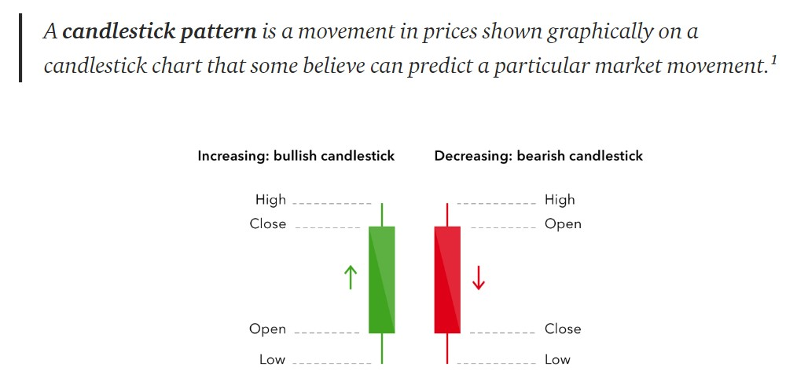

### Colour of the candlestick
The colour of a candlestick is used to indicate the way in which a market has previously moved or is currently moving. From the above example, you can see that the chart will be green if the close price is higher than the open price, and will be red if the close price is lower than the open price. As such, the colour of a candlestick is a good indicator of whether a market was bullish or bearish during the given period.

When looking at a candlestick chart, the candlestick on the far left will be from the oldest trading period, and the one on the far right will represent the newest or current trading period. The current candlestick can be moving because the current price is used instead of the close price, meaning the candlestick’s colour could shift from green to red or vice versa before the trading period is over.

Sometimes, you may find that the candlesticks on a graph are filled and not filled, rather than being green and red. An unfilled or white candlestick is the same as a green candlestick, and a filled or black candlestick is the same as a red candlestick.

### Body of the candlestick
The body of a candlestick is used to show the difference between an asset’s open and close price (or the current price for the candlestick on the far right). If the candlestick is green, then the bottom of the body represents the opening price and the top represents the closing price. If the candlestick is red, then the opposite is true, and the top represents the opening price and the bottom represents the closing price.

Equally, if the body of the candlestick is long then there has been a period of intense buying and selling. If the body of the candlestick is short, then there has been more of a consolidation in the market for that period.

### Wick of the candlestick
The wick or ‘shadow’ of the candlestick shows the highest and lowest prices reached by an asset in the given time period. The top wick, also known as the upper shadow, is the highest price. The bottom wick, or lower shadow, is the lowest price.

A candlestick with a long upper wick and short lower wick shows that buyers were very active during a trading period. However, sellers soon forced prices to fall from their highs, causing the markets to close lower than the level which the upper wick reached. The weak closing price created the long upper shadow.

Conversely, a candlestick with a long lower wick and short upper wick shows us that sellers drove prices lower initially, but then buyers bought cheap and caused prices to recover, with the markets finishing strongly as evidenced by the long lower shadow.

## How to use candlesticks when trading
The different parts of a candlestick pattern all tell you something. What they tell you is another question entirely. Sometimes, the shape, colour and direction of a candlestick can seem random, but other times a number of candlesticks may form up to make a pattern.

Candlestick patterns are capable of revealing areas of support and resistance, and are also valuable to traders as a means through which they can confirm their predictions about market movements. However, it is worth mentioning that there is a lot that candlesticks cannot tell you. For instance, you can’t use candlesticks to tell you why the open and close are similar or different.

As such, candlestick patterns should be used in conjunction with other forms of technical and fundamental analysis to greater confirm a trader’s suspicions of an overall trend.

## Long Versus Short Bodies
Generally speaking, the longer the body is, the more intense the buying or selling pressure. Conversely, short candlesticks indicate little price movement and represent consolidation.

### Long white candlesticks show strong buying pressure.
The longer the white candlestick is, the further the close is above the open. This indicates that prices advanced significantly from open to close and buyers were aggressive. While long white candlesticks are generally bullish, much depends on their position within the broader technical picture. After extended declines, long white candlesticks can mark a potential turning point or support level. If buying gets too aggressive after a long advance, it can lead to excessive bullishness.

### Long black candlesticks show strong selling pressure.
The longer the black candlestick is, the further the close is below the open. This indicates that prices declined significantly from the open and sellers were aggressive. After a long advance, a long black candlestick can foreshadow a turning point or mark a future resistance level. After a long decline, a long black candlestick can indicate panic or capitulation.

### Marubozu 

Marubozu do not have upper or lower shadows and the high and low are represented by the open or close. A White Marubozu forms when the open equals the low and the close equals the high. This indicates that buyers controlled the price action from the first trade to the last trade. Black Marubozu form when the open equals the high and the close equals the low. This indicates that sellers controlled the price action from the first trade to the last trade.

## Long Versus Short Shadows
The upper and lower shadows on candlesticks can provide valuable information about the trading session. Upper shadows represent the session high and lower shadows the session low. Candlesticks with short shadows indicate that most of the trading action was confined near the open and close. Candlesticks with long shadows show that prices extended well past the open and close.
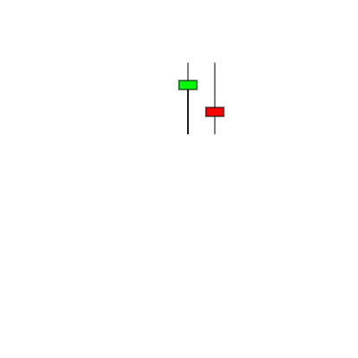
Candlesticks with a long upper shadow and short lower shadow indicate that buyers dominated during the session, bidding prices higher, but sellers ultimately forced prices down from their highs. This contrast of strong high and weak close resulted in a long upper shadow. Conversely, candlesticks with long lower shadows and short upper shadows indicate that sellers dominated during the session and drove prices lower. However, buyers later resurfaced to bid prices higher by the end of the session; the strong close created a long lower shadow.

# Types of candlestick patterns
There are many candlestick patterns, which act as useful indicators for traders looking to make price movement predictions.

## Hammer candlesticks
For instance, one of the bullish candlestick patterns is known as the ‘hammer’ and is formed of a short body with a long lower wick. It is normally found at the end of a downward trend and can be a good indicator of future upward trends.
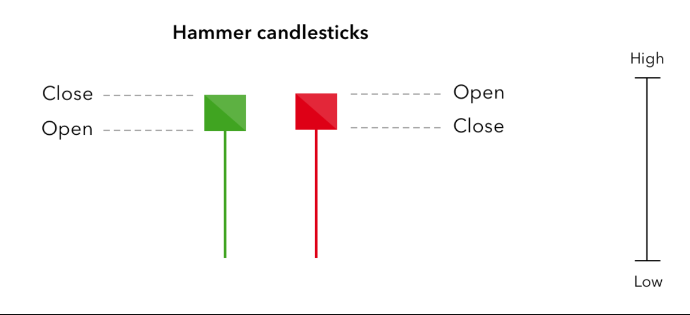

## Doji candlestick
Another candlestick pattern is the doji, which many believe indicates uncertainty from traders in the market. The doji is comprised of a short or non-existent body and wicks of varying length. Sometimes, a doji can resemble a cross, because a doji’s pattern often has similar open and close positions but varying session high and low positions.
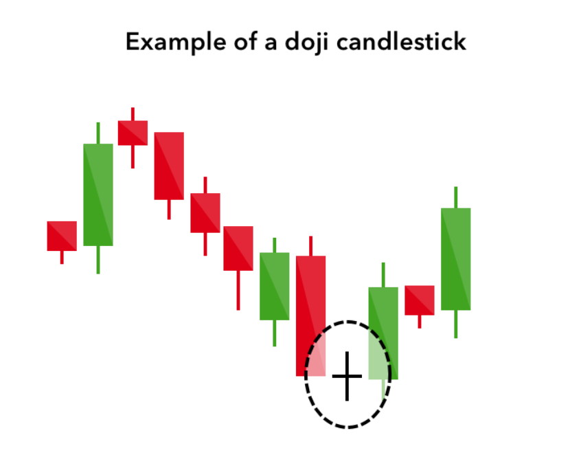

## Six bullish candlestick patterns
Bullish patterns may form after a market downtrend, and signal a reversal of price movement. They are an indicator for traders to consider opening a long position to profit from any upward trajectory.

## Hammer
The hammer candlestick pattern is formed of a short body with a long lower wick, and is found at the bottom of a downward trend.
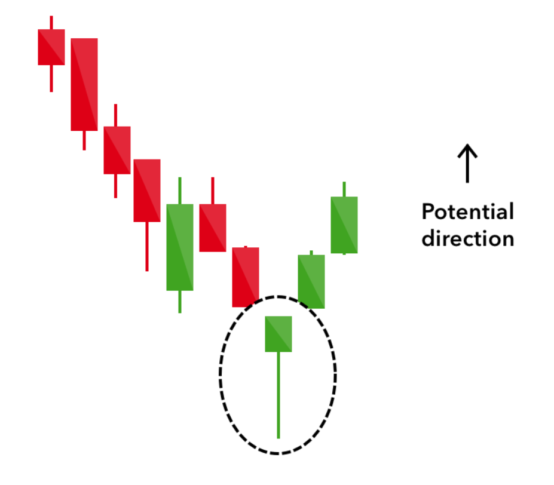
A hammer shows that although there were selling pressures during the day, ultimately a strong buying pressure drove the price back up. The colour of the body can vary, but green hammers indicate a stronger bull market than red hammers.

---

## Inverse hammer
A similarly bullish pattern is the inverted hammer. The only difference being that the upper wick is long, while the lower wick is short.
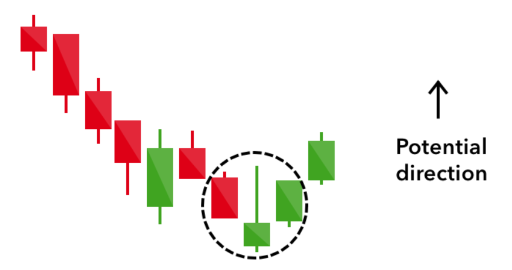
It indicates a buying pressure, followed by a selling pressure that was not strong enough to drive the market price down. The inverse hammer suggests that buyers will soon have control of the market.

---

## Bullish engulfing
The bullish engulfing pattern is formed of two candlesticks. The first candle is a short red body that is completely engulfed by a larger green candle.
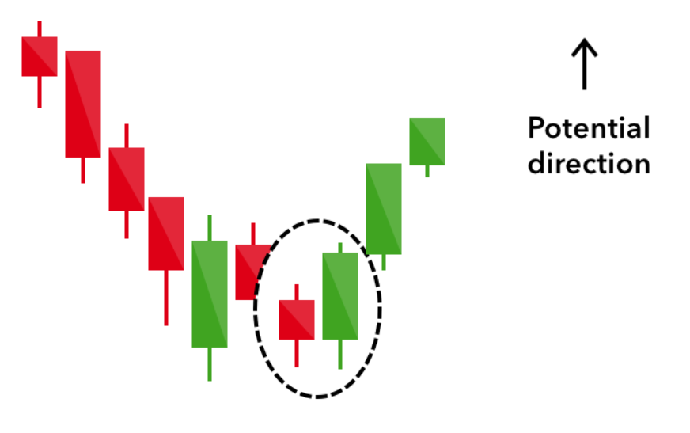
Though the second day opens lower than the first, the bullish market pushes the price up, culminating in an obvious win for buyers.

---

## Piercing line
The piercing line is also a two-stick pattern, made up of a long red candle, followed by a long green candle.
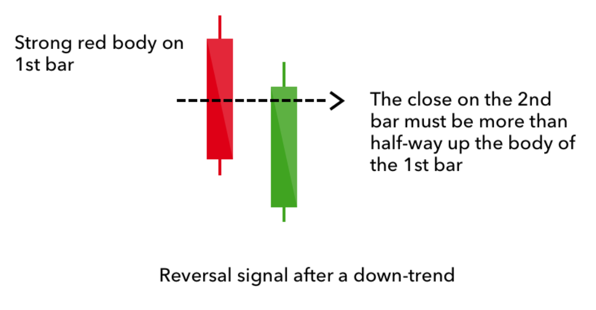
There is usually a significant gap down between the first candlestick’s closing price, and the green candlestick’s opening. It indicates a strong buying pressure, as the price is pushed up to or above the mid-price of the previous day.

---

## Morning star
The morning star candlestick pattern is considered a sign of hope in a bleak market downtrend. It is a three-stick pattern: one short-bodied candle between a long red and a long green. Traditionally, the ‘star’ will have no overlap with the longer bodies, as the market gaps both on open and close.
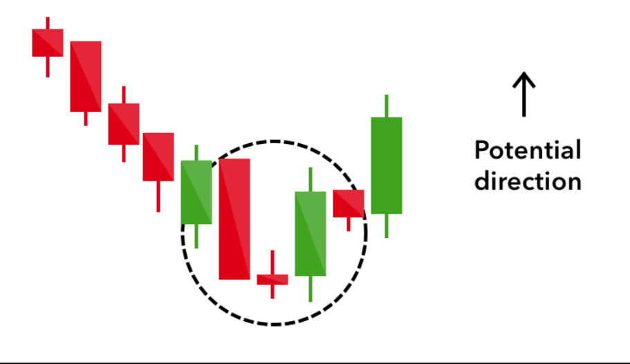
It signals that the selling pressure of the first day is subsiding, and a bull market is on the horizon.

---

## Three white soldiers
The three white soldiers pattern occurs over three days. It consists of consecutive long green (or white) candles with small wicks, which open and close progressively higher than the previous day.
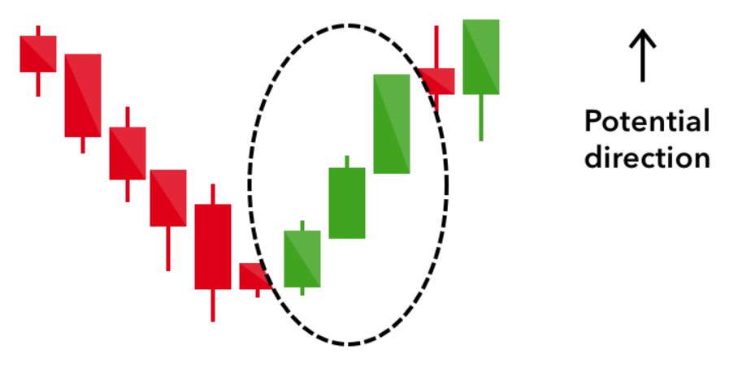
It is a very strong bullish signal that occurs after a downtrend, and shows a steady advance of buying pressure.

---
# Six bearish candlestick patterns
---
Bearish candlestick patterns usually form after an uptrend, and signal a point of resistance. Heavy pessimism about the market price often causes traders to close their long positions, and open a short position to take advantage of the falling price.

---

## Hanging man
The hanging man is the bearish equivalent of a hammer; it has the same shape but forms at the end of an uptrend.
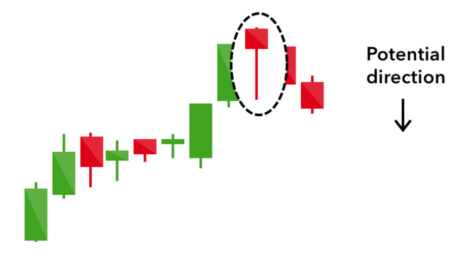
It indicates that there was a significant sell-off during the day, but that buyers were able to push the price up again. The large sell-off is often seen as an indication that the bulls are losing control of the market.

---

## Shooting star
The shooting star is the same shape as the inverted hammer, but is formed in an uptrend: it has a small lower body, and a long upper wick.
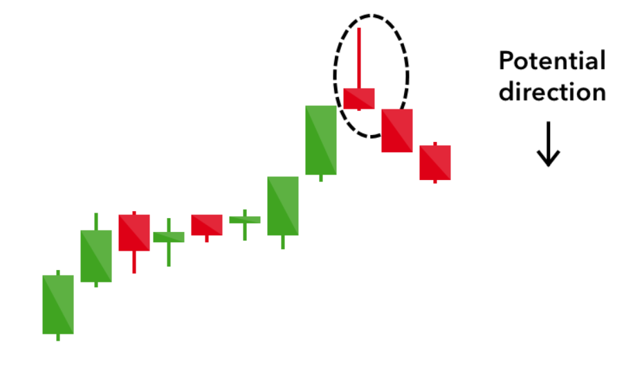
Usually, the market will gap slightly higher on opening and rally to an intra-day high before closing at a price just above the open – like a star falling to the ground.

---

## Bearish engulfing
A bearish engulfing pattern occurs at the end of an uptrend. The first candle has a small green body that is engulfed by a subsequent long red candle.
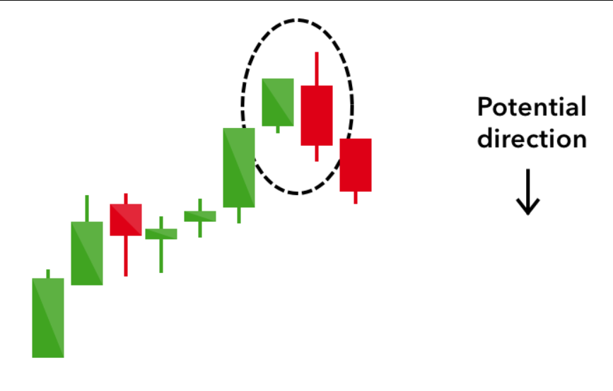
It signifies a peak or slowdown of price movement, and is a sign of an impending market downturn. The lower the second candle goes, the more significant the trend is likely to be.

---

## Evening star
The evening star is a three-candlestick pattern that is the equivalent of the bullish morning star. It is formed of a short candle sandwiched between a long green candle and a large red candlestick.
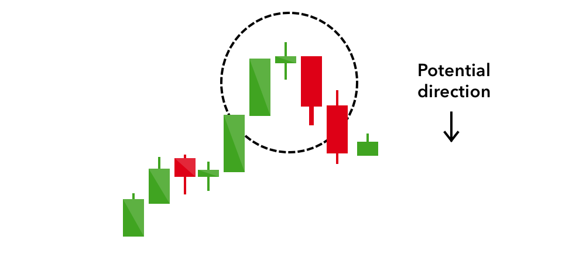
It indicates the reversal of an uptrend, and is particularly strong when the third candlestick erases the gains of the first candle.

---

## Three black crows
The three black crows candlestick pattern comprises of three consecutive long red candles with short or non-existent wicks. Each session opens at a similar price to the previous day, but selling pressures push the price lower and lower with each close.
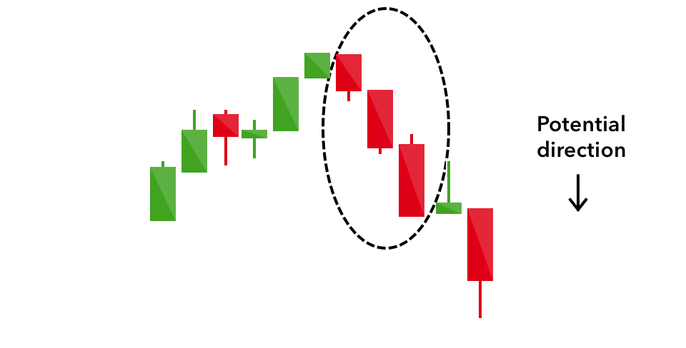
Traders interpret this pattern as the start of a bearish downtrend, as the sellers have overtaken the buyers during three successive trading days.

---

## Dark cloud cover
The dark cloud cover candlestick pattern indicates a bearish reversal – a black cloud over the previous day’s optimism. It comprises two candlesticks: a red candlestick which opens above the previous green body, and closes below its midpoint.
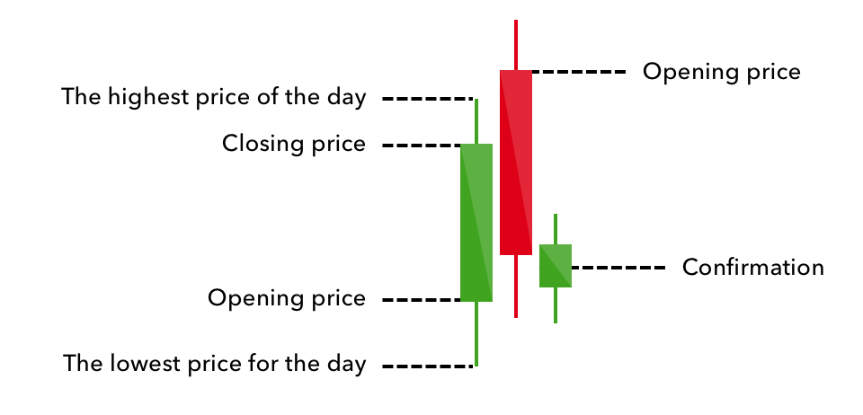
It signals that the bears have taken over the session, pushing the price sharply lower. If the wicks of the candles are short it suggests that the downtrend was extremely decisive.

---
## Four continuation candlestick patterns
---
If a candlestick pattern doesn’t indicate a change in market direction, it is what is known as a continuation pattern. These can help traders to identify a period of rest in the market, when there is market indecision or neutral price movement.

---

## Doji
When a market’s open and close are almost at the same price point, the candlestick resembles a cross or plus sign – traders should look out for a short to non-existent body, with wicks of varying length.
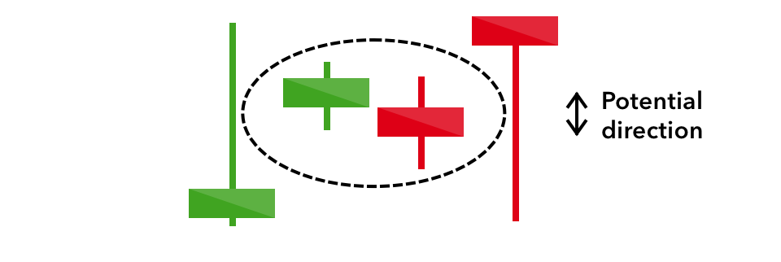
This doji’s pattern conveys a struggle between buyers and sellers that results in no net gain for either side. Alone a doji is neutral signal, but it can be found in reversal patterns such as the bullish morning star and bearish evening star.

---

## Spinning top
The spinning top candlestick pattern has a short body centred between wicks of equal length. The pattern indicates indecision in the market, resulting in no meaningful change in price: the bulls sent the price higher, while the bears pushed it low again. Spinning tops are often interpreted as a period of consolidation, or rest, following a significant uptrend or downtrend.

On its own the spinning top is a relatively benign signal, but they can be interpreted as a sign of things to come as it signifies that the current market pressure is losing control.

---
## Falling three methods
Three-method formation patterns are used to predict the continuation of a current trend, be it bearish or bullish.
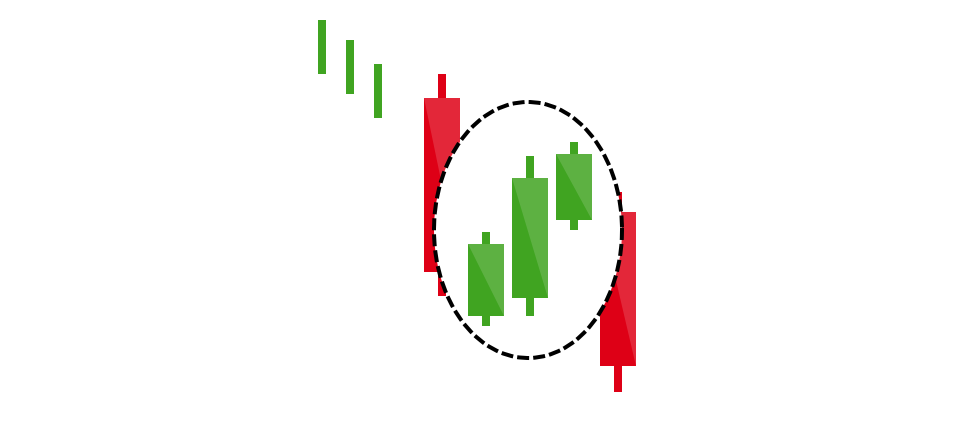
The bearish pattern is called the ‘falling three methods’. It is formed of a long red body, followed by three small green bodies, and another red body – the green candles are all contained within the range of the bearish bodies. It shows traders that the bulls do not have enough strength to reverse the trend.

---
## Rising three methods
The opposite is true for the bullish pattern, called the ‘rising three methods’ candlestick pattern. It comprises of three short reds sandwiched within the range of two long greens. The pattern shows traders that, despite some selling pressure, buyers are retaining control of the market.

## Other Pattern

----

